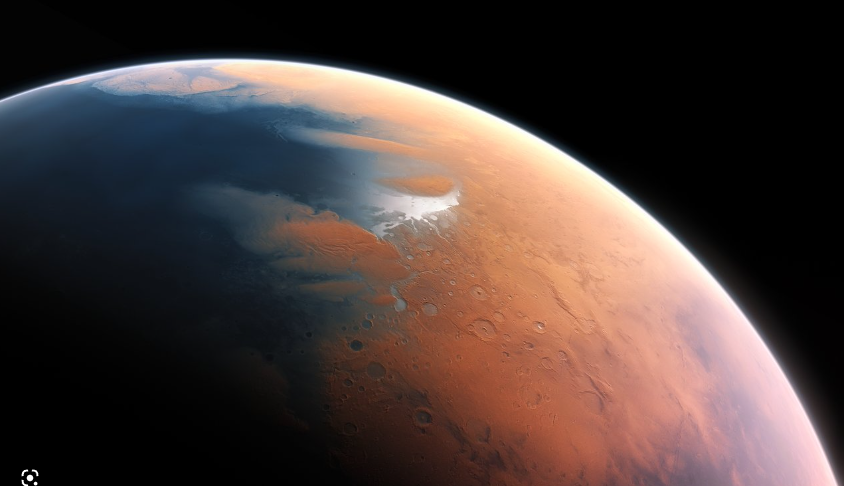
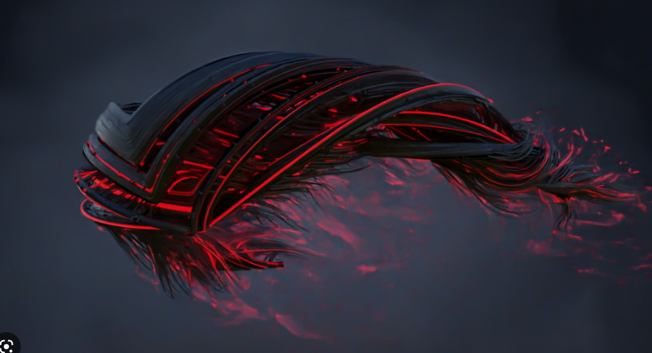
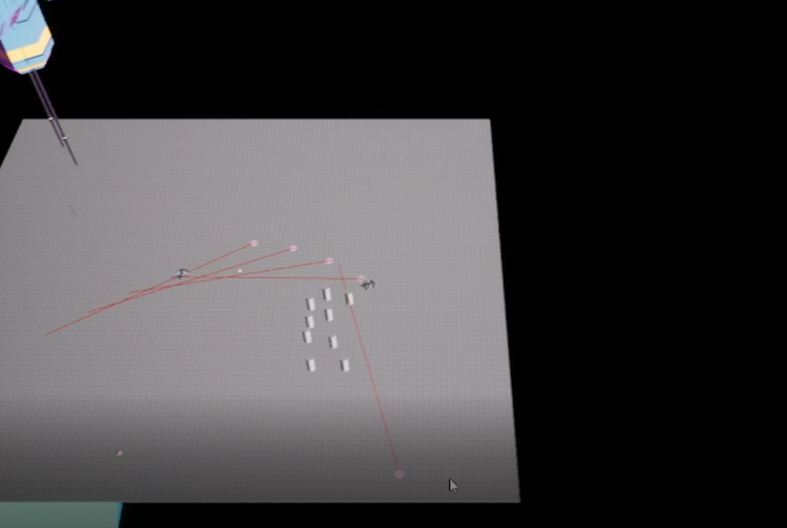

# Dark space dawn
## game docs

## Описание игровой вселенной

Действия начинают развиваться с планеты Mars 2122, которая была колонизирована в 2122 году

Действия игры происходят в 2278 году.

Население планеты на 2208 год : ~ 39 700 000 человек
По размерам планета в 10 раз меньше планеты Земля
Не имеет спутников, населена животными, растительностью, но имеет атмосферу красноватго цвета,
следоваетльно именно из-за этого и название, схожее с названием с планетой Марс в солнечной системе
Возможно после колонизации появилось несколько похожих по названию планет

Другие расы и их характеристики ???

Раса: люди с генетической модификацией и предрасположенностью к внедрению имплантантов технического типа.
Модификации были выполнены для улучшения переносимости различных условий 
в которых обычный человек не смог бы выжить.
Так же данная раса имеет более чем в 10 раз увеличенный срок жизни по сравнению с обычными людьми

Расположение планеты в неизвестной системе, после колонизации остались данные
о существовании некоторых других планет данной расы, но
даннные о местоположении как и звездные карты были утеряны или уничтожены специально.

Для убедительности систему назвали аналогичным названием Mars

Солнечная система осталась в недосягаемости. (О ее существовании на момент 2208 года мало кто вспоминал)

В 2249 году на планете был обнаружен элемент, который в дальнейшем назвали 
темным эфиром, с помощью него удалось усовершенствовать двигатели космических кораблей для безграничных перелетов

Элемент до сих пор остается полностью неизученным, но имеет огромную ценность

Прошло уже довольно много времени после первой колонизации, связи с другими планетами и представителями других рас были налажены

### Протогонист *ГГ
Девушка 23 лет, которая недавно получила звание пилота грузового корабля

## Сюжет.

После выпуска из Летной академии ГГ начинает практику на грузовом корабле, по доставке грузов между колониями
Спустя несколько лет в систему с Родной планетой ГГ вторгаются неизвестные человекоподобные существа с одной лишь целью
Истрибить все живое, на контакт данные существа не идут, но как удалось выяснить они все понимают, а значит  преследуют свои цели.

Спустя некоторое время и попытки отбиваться планетарное правительство принимает решение об эвакуации оставшихся жителей планеты.
Через некоторое время планета подвергается тотальному разрушению.

Игровой процесс подразумевает изучения космоса с horro составляющей ( музыкальное сопровождение, системы без света, мертвые звезды, неизученные аномалиии), 

Изучение аномальных явлений, 
Сбор ифнормации о противнике и о своей расе, 
а так же необходимо выяснить, что же именно случилось с родной звездной системой ГГ

И основная задача это постараться выжить в этом темнном космосе.

## Обучение: первой задачей становится эвакуация жителей с планеты

## Похожие игры
### Star wolves

### Space rangers

### Mass effect 

### Home world

## Механики

* Игра представляет собой TOP down стратегию с интуитивным управлением для RTS
* ЛКМ выделение юнитов, передвижение юнитов (ETC)
* Поасадки на космические станции, планеты, корабли гиганты
* Сбор космических обьектов
* Возможность обновить корабль
* Торговля оборудованием и ресурсами
* Возможность разворачивать свои станиции, спутники и управлять ими
* Нападения на другие космические корабли
* Ведение диалогов с другими NPC (космические корабли, космические станции etc)
* Сканирование неизвестных секторов и аномальных зон
* Получение новых артефактов ( увеличение мощности кораблей )
* Возможность встраивать новые иплантанты в организм ГГ
* Подвержение радиактивному излучению и болезням
* Обеспечение потребностей персонажа (сон еда вода температура тела, уровень стресса и психического состояния)
* Возможность набирать команду и управлять ей
* Замедление времени практически до нуля ( режим тактической паузы), 
так как игра довольно динамичная это будет необходимо для перемещения и взаимодействия межжду кораблями, можно взять игровой опыт из игры X4 где в данном случае все происходит довльно медленно, например, чтобы просто развернуть огромный карабль требуется большое количество времени, в данной игре же мы должны уважать личное время игроков и постараться сделать все механики динамичными

## Реализация взаимодействия c планетами, станциями после посадки на них

Взаимодействие представляет собой интерфейс визуальной новеллы с сохранением состояния персонажа
Квесты (уникальные и повторяющиеся так же будут выполнены в данной стилистике)

## AILifeSystem
Система управления NPC как в фоновом режиме ( без рендера моделей )
так и в режиме рендера обьектов рядом с юнитами игрока в определенном радиусе
* Отношения NPC к игроку
* Генерация аномальных зон
* Перемещение NPC и взаимодействие между собой
* Динамическая генерация новых NPC

